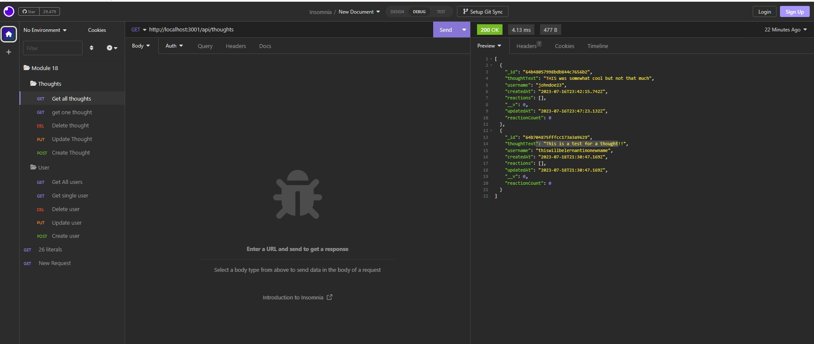

# 18-Social-Media-API
This is a repo for the 18th Challenge from Tec de Monterrey &amp; EdX bootcamp.


## Description

This project is a Social Network API that uses MongoDB and Mongoose ODM to work with data, Javascript, Express and Node to manage the backend routes. This only consists of the backend and should be later matched with front-end development. With the current routes, the Database can store both Users & Thoughts (that can be considered as posts from any social media application), and the user can perform al CRUD operations. Look into an application like Insomnia or Postman to test these routes! 

## Table of contents

- [Installation](#installation)
- [Mockup](#mockup)
- [Video](#video)
- [Credits](#credits)
- [License](#license)
- [Contributing](#contributing)
- [Tests](#tests)
- [Questions](#questions)

## Installation
Please use ```npm i``` to install the dependencies needed for this project (make sure you have Node.JS installed). Use ```npm start``` to run the server.


## Mockup
Create a folder on insomnia like the one on the following image:



Then create routes (post,get,delete,put) on the http://localhost:3001/api/thoughts & http://localhost:3001/api/users path

## Video
Follow this link to a video walktrough 

## Credits
This back-end application acceptance criteria was provided by EdX bootcamps & Tec de Monterrey. The functionality was coded by me with support from a tutor.

## License
This project is licensed under the MIT license.

## Contributing
This repo is not open for contributions.

## Tests
N/A

## Questions
If you have any questions about the repo, open an issue or contact me directly at testemail@hotmail.com. You can find more of my work at [AlexTrejo92](https://github.com/AlexTrejo92).